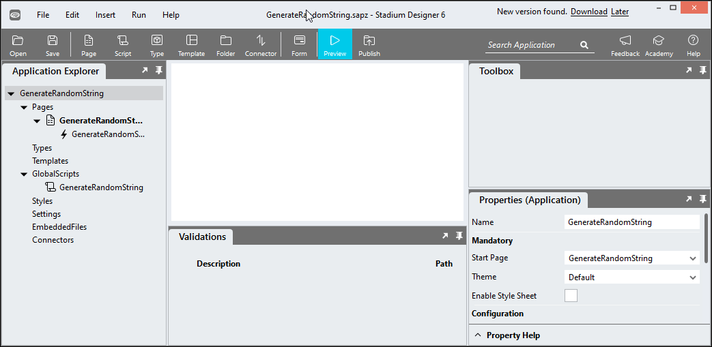

# Generate Random String

A script to generate a random string of any length optionally including upper- and lowercase characters, numbers or selected special characters

# Version 

1.0 Initial

1.1 All settings true by default

1.2 Fix "false" bug

# Global Script Setup
1. Create a Global Script called "GenerateRandomString"
2. Add the input parameters below to the Global Script
   1. Length
   2. Lowercase
   3. Numbers
   4. Special
   5. Uppercase
3. Add the output parameter below to the Global Script
   1. Result
4. Drag a *JavaScript* action into the script
5. Add the Javascript below unchanged into the JavaScript code property
```javascript
/* Stadium Script Version 1.2*/
let lengthParameter = ~.Parameters.Input.Length || 12;
if (isNaN(parseFloat(lengthParameter))) lengthParameter = 12;
let lowercaseParameter = ~.Parameters.Input.Lowercase;
lowercaseParameter = lowercaseParameter == 'false' || lowercaseParameter == false ? false : true;
let numbersParameter = ~.Parameters.Input.Numbers;
numbersParameter = numbersParameter == 'false' || numbersParameter == false ? false : true;
let uppercaseParameter = ~.Parameters.Input.Uppercase;
uppercaseParameter = uppercaseParameter == 'false' || uppercaseParameter == false ? false : true;
let specialParameter = ~.Parameters.Input.Special;
specialParameter = specialParameter == 'false' || specialParameter == false ? false : true;

let result = '';
let uppercase = 'ABCDEFGHIJKLMNOPQRSTUVWXYZ';
let lowercase = 'abcdefghijklmnopqrstuvwxyz';
let numbers = '0123456789';
let special = '~!@#$%^&*()_-+={]}[|]:;<,>.?/}';

let characters = '';
if (uppercaseParameter) characters += uppercase;
if (lowercaseParameter) characters += lowercase;
if (numbersParameter) characters += numbers;
if (specialParameter) characters += special;
const charactersLength = characters.length;
let counter = 0;
characters = sortArrayRandomly(characters.split(""));
characters = characters.join("");
while (counter < lengthParameter) {
  result += characters.charAt(Math.floor(Math.random() * charactersLength));
  counter += 1;
}
return result;

function sortArrayRandomly(d) {
  let currentIndex = d.length,  randomIndex;
  while (currentIndex > 0) {
    randomIndex = Math.floor(Math.random() * currentIndex);
    currentIndex--;
    [d[currentIndex], d[randomIndex]] = [
      d[randomIndex], d[currentIndex]];
  }
  return d;
}
```
6. Drag a *SetValue* action into the Global Script and place it under the *JavaScript* action
   1. Target: = ~.Parameters.Output.Result
   2. Value: = ~.Javascript



## Usage
1. Drag the script called "GenerateRandomString" into a script or event handler
2. Enter values for the script input parameters
   1. Length: Integer (default: 12)
   2. Lowercase: Boolean (default: false)
   3. Numbers: Boolean (default: false)
   4. Special: Boolean (default: false)
   5. Uppercase: Boolean (default: false)
3. Result: The script returns a string of the requested length
